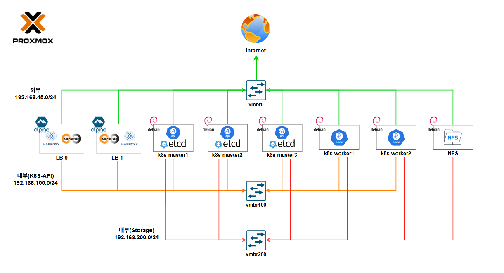

 
 
 

# 🖥️ Hardware Specifications

 

 
 
 

# 🏗️ Architecture & Topology 

 
 
 

# ✨ Tech Stack
### 🏗 OS & Infrastructure & Storage

 

 
 

 

### 🌐 Networking & Security

 

 

### 🚀 CI/CD & Observability

 

 

### 🛠 Tools

 
